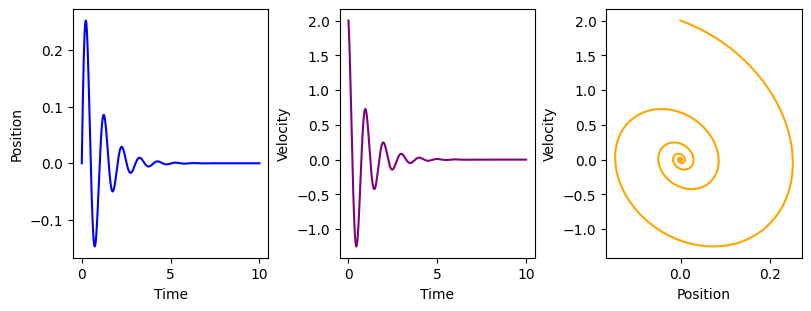

# Harmonic Oscilator

From Hooke's law, we have $F = -kx$ where $k$ is the constant 
factor characteristic of the spring  and $x$ is the distance 
that the spring is extended or compressed.

Also, from Newton's second law, we have $F = ma$, where $m$ 
is the mass, and $a$ is the acceleration.

So we can write: $m\ddot{x} = -kx$.

If we consider damping (friction), we will have the extra term $-d\dot{x}$ 
on the right side, which models the friction force
that is proportional to the velocity $\dot{x}$. 
Now we can write the balancing force equation as:

$$
m\ddot{x} + d\dot{x} + kx = 0
$$

To model this second-order Ordinary Differential Equation (ODE), we'll write it in
matrix form in order to convert it to a first-order ODE:

$$
\begin{aligned}
\dot{x} &= v \\
\dot{v} &= - \frac{d}{m}v - \frac{k}{m} x 
\end{aligned}
$$

By substituting $\omega^2 = \frac{k}{m}$ and $2\zeta\omega = \frac{d}{m}$, we can write:

$$
\frac{d}{dt}
\begin{bmatrix}
x \\ v
\end{bmatrix}
=
\begin{bmatrix}
0 & 1 \\
-\omega^2 & -2\zeta\omega \\
\end{bmatrix}
\begin{bmatrix}
x \\ v
\end{bmatrix}
$$

$\omega = \sqrt{\frac{k}{m}}$ is called the "undamped angular frequency of the oscillator", and $\zeta = \frac{d}{2\sqrt{km}} $ is called the "damping ratio".

If we call the above 2x2 matrix $A$ and the $x$ and $v$ vector $\mathbf{x}$, we have the following first-order ODE: 
$$
\frac{d \mathbf{x}(t)}{dt} = A \mathbf{x}(t)
$$

By using forward Euler method, we can get an update rule for our ODE:

$$
\begin{aligned}
\frac{\Delta \mathbf{x}}{\Delta t} &= A \mathbf{x}\\
\Delta \mathbf{x} &= A \mathbf{x} \Delta t\\
\mathbf{x}_{k+1} &= \mathbf{x}_{k} +  A \mathbf{x}_k \Delta t
\end{aligned}
$$

## Code

Check `oscilator.ipynb` for the code and plots

### Example 

## References

[Youtube, Example Second-Order ODE: Spring-Mass-Damper - Steve Brunton](https://youtu.be/r1eWerqrcqo?feature=shared)

[Wikipedia, Damped Harmonic Oscillator](https://en.wikipedia.org/wiki/Harmonic_oscillator#Damped_harmonic_oscillator)