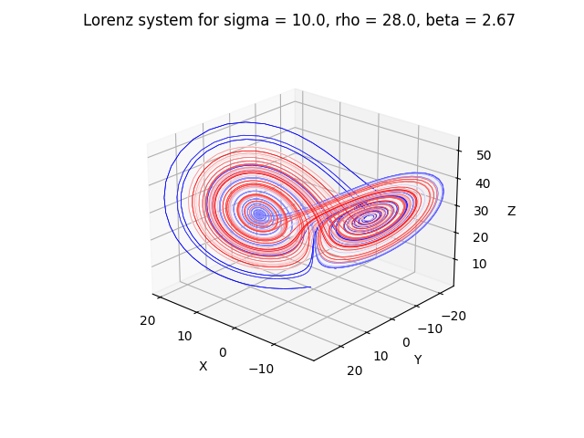

# Lorenz Dynamical System

States: $X = [x, y, z]$ 

Parameters: $B = [\sigma, \rho, \beta]$

The Lorenz equations are as follows:

$$
\begin{aligned}
\frac{d x}{d t} &= \rho ( y - x) \\
\frac{d y}{d t} &= x (\rho - z) - y \\
\frac{d z}{d t} &= x y - \beta z 
\end{aligned}
$$

## Plot

Set initial state and parameter in `lorenz.py` and run `python lorenz.py` after installing required packages.

### Example

